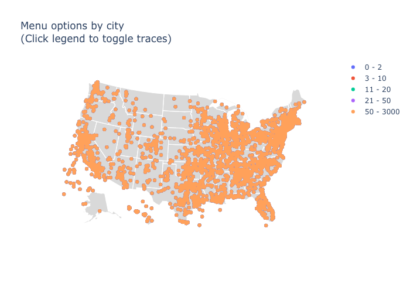

# TAMU Datathon 2019
## Project Title: "Taco 'Bout It!"

## Inspiration
Tacos and burritos are delicious, obviously!!!

## Data
We used [this list of ~19,000 restaurants that serve tacos and/or burritos](https://www.kaggle.com/datafiniti/restaurants-burritos-and-tacos), available on Kaggle. 

## What it does
We try to answer the broad question "where are the authentic Mexican restaurants in the U.S."?

## How we built it
Coding in Python, using jupyter notebooks, and on the backs of pandas and plotly.

## Challenges we ran into
Data cleaning took way longer than expected! For example, every location metric was incomplete in some way (missing values, inconsistent implementation, etc.).

Also, there were at least **FOUR** different ways to refer to "McDonald's" and "Sonic" in the dataset!

## What we learned
Learned how to use geopy (even though we ended up not using it), and got much more familiar with plotly!

## What's next for Taco 'Bout It!
Clean up the code a little bit, make a visualization of all the authentic tacos/burritos in the U.S. using something like seaborn.kdeplot, and put it up on Github!

## Built With
`jupyter`
`numpy`
`pandas`
`plotly`
`python`

